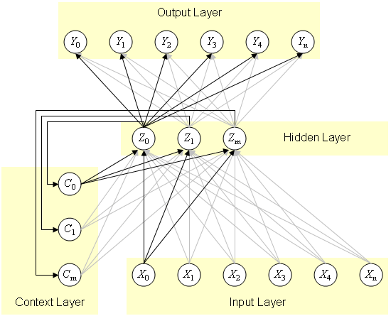

# SIMPLE-VANILA-RECURENT-NEURAL-NETWORK

Because the purpose of this project is education - I made it as simple as posible;

This is sequence prediction network.

The NET is learning this sequence: = ".Simple Recurrent Network." ..... 

These are feedForward() and backPropagate() passes:

	void feedForward()
	{
		v_hidden = dotVM_b(v_inputs, wih) + dotVM_b(v_context, wch);   // Calculate input and context connections to hidden layer.
		v_hidden = sigm(v_hidden);

		v_output = dotVM_b(v_hidden, who);                             //  Calculate the hidden to output layer.
		v_output = sigm(v_output);

		v_context = v_hidden;                                          // Copy outputs of the hidden to v_context layer.
	}
	void backPropagate()
	{
		err_o = (v_target - v_output) * sigmoidDerivative(v_output);   // Calculate the output layer error.              
		err_h = dotVM(err_o, who)     * sigmoidDerivative(v_hidden);   // Calculate the hidden layer error.

		who = who + deltaWeights_b(learnRate, v_hidden, err_o);        // Update the weights for the output layer.  
		wih = wih + deltaWeights_b(learnRate, v_inputs, err_h);        // Update the weights for the hidden layer.
	}

This is Visual Studio 2015 C++ project;
